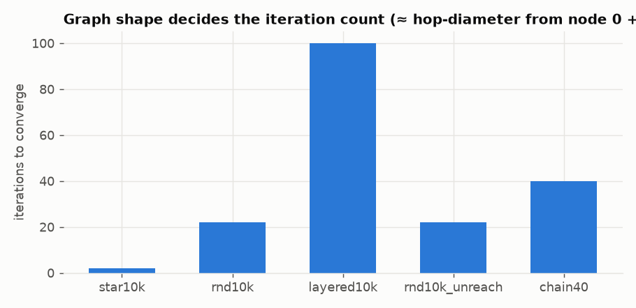
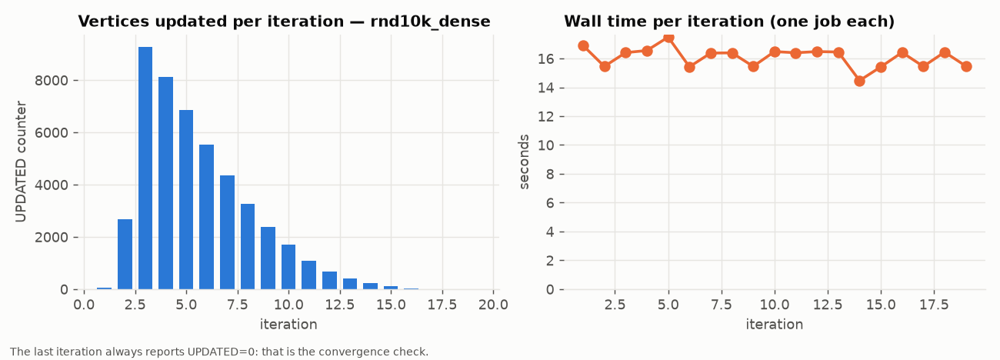
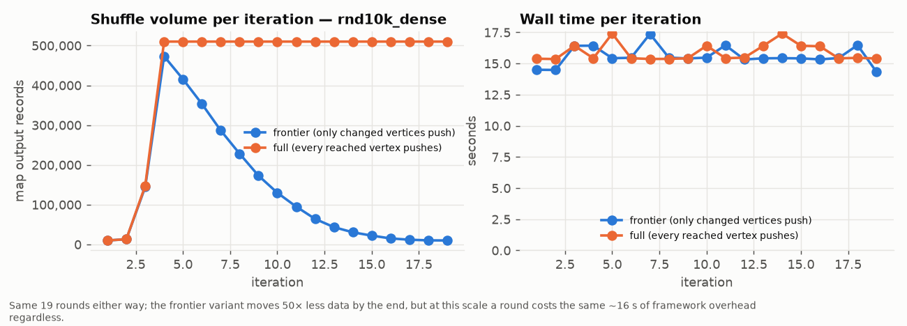
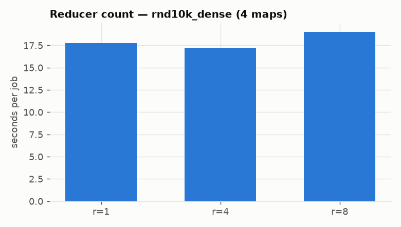
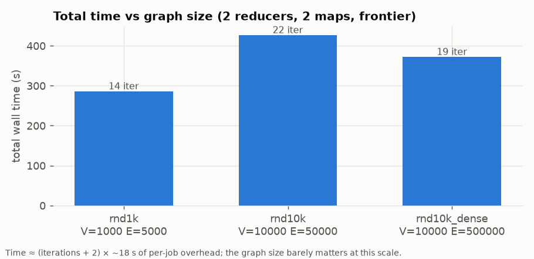

# Section 1, Q2 — Single-Source Shortest Path with iterative MapReduce

Shortest distances from node 0 in a weighted directed graph, computed as a
chain of Hadoop Streaming jobs written in C++: one preparation job, one job
per Bellman-Ford-style relaxation round until nothing changes, and one job to
format and sort the answer.

| File | Purpose |
|---|---|
| `src/prep_map.cpp`, `src/prep_reduce.cpp` | edge list → one adjacency record per vertex |
| `src/sssp_map.cpp`, `src/sssp_combine.cpp`, `src/sssp_reduce.cpp` | one relaxation round |
| `src/final_map.cpp`, `src/final_reduce.cpp` | records → `node dist` / `INF`, sorted by node id |
| `src/sssp_common.hpp` | record format, parsing helpers |
| `run_hadoop.sh` | the driver: prep → iterate until the `UPDATED` counter is 0 → final |
| `run_local.sh` | the same pipeline with `sort` as the shuffle, no Hadoop needed |
| `oracle.py` | Dijkstra reference |
| `gen_graph.py` | seeded generator: random / chain / layered / star, optional unreachable vertices |
| `verify.sh` | 28 checks against the oracle (hand-made + generated, both propagation modes) |
| `bench_cluster.sh`, `plot.py` | cluster benchmark and its figures/tables |
| `tests/` | hand-made inputs (PDF sample, V = 2, unreachable nodes, cycles, multi-edges, self-loop, source with no out-edges) |

## Build and run

```bash
make                                   # bin/* (g++ -O2 -std=c++17)
bash verify.sh                         # local pipeline vs Dijkstra, 28 cases
bash run_local.sh tests/sample.txt     # prints "node dist" lines, iteration log on stderr

source ../../hadoop/env.sh             # HADOOP_HOME, HADOOP_CONF_DIR, STREAMING_JAR
bash run_hadoop.sh graph.txt out.txt --reducers 4 --maps 4 [--mode frontier|full]
```

On RCE the Hadoop 3.3.6 cluster is brought up per job by
`../../hadoop/cluster.sbatch` (see `../../hadoop/README.md`), and
`bench_cluster.sh` is what the benchmark job ran.

Input: first line `V E`, then `u v w` per edge. Output: `V` lines
`node_id distance` (or `INF`), ascending by node id.

## Design

### The vertex record

Everything that flows from one iteration to the next is one line per vertex:

```
node \t dist \t flag \t v1:w1,v2:w2,...
```

`dist = -1` stands for ∞; `flag = 1` marks a vertex whose distance changed in
the previous round; the adjacency list rides along so the graph structure is
never re-read from the original edge list. Node 0 starts as `0 \t 0 \t 1 \t …`,
everyone else as `-1 \t 0`.

### Prep job — edge list → records

*Mapper:* an edge `u v w` emits `u \t E \t v:w` (an out-edge of u) and
`v \t V` (v exists). The header line `V E` — recognised by having two fields
instead of three — emits `i \t V` for every `i < V`, so a vertex that touches
no edge at all still gets a record and still appears in the output as `INF`.
*Reducer:* concatenates the out-edges of each vertex into its record.

### Iteration job — one relaxation round

*Mapper*, for each record:
- re-emits the record unchanged under key `node` with tag `N` (the structure
  must survive the round), and
- if the vertex is reached (`dist ≠ -1`) and — in *frontier* mode — its flag is
  set, emits `v \t D \t dist + w` for every out-edge.

*Combiner:* per key, keeps the minimum `D` and passes the `N` record through.
Since a vertex with in-degree *d* receives *d* candidates, the combiner cuts
the shuffle by roughly the average in-degree.

*Reducer*, per key: `new = min(old dist, min candidate)`. It writes the
record back with `flag = 1` iff the distance improved, and if it improved it
increments the Hadoop counter **`SSSP.UPDATED`** by writing
`reporter:counter:SSSP,UPDATED,1` on stderr — the one channel Streaming
gives a C++ program back to the framework.

*Driver:* after each job it reads `UPDATED` from the job's counter block. Zero
means no distance changed anywhere, so the next round would be identical:
converged. Bellman-Ford guarantees this within `V − 1` rounds; the driver stops
at the first all-zero round, which is `(hop-diameter from node 0) + 1` jobs.

### Frontier vs full propagation (`--mode`)

The textbook formulation has *every* reached vertex push its distance every
round. The frontier variant pushes only from vertices whose distance changed
in the previous round. It is exact — distances only decrease and every
decrease is pushed exactly once, in the very next round — and it makes the
intermediate data shrink to the size of the wave-front instead of growing to
the whole reached set. Both modes are implemented and the benchmark measures
the difference (`--mode full` is the same reducer; only the mapper's emit
condition differs).

### Final job — the output format

`final_map` turns each record into `node \t dist` (or `INF`). The job runs
with one reducer and
`KeyFieldBasedComparator -n`, so the single output file is sorted
numerically by node id (a plain text sort would put 10 before 2). The reducer
is an identity; the job's `textoutputformat.separator` is set to a space so
the file reads `node dist` exactly as required, with no trailing tab.

### Number of mappers

Streaming uses the old-API `TextInputFormat`, whose split size is
`max(minsize, min(total/mapreduce.job.maps, blocksize))`. `run_hadoop.sh` sets
both `mapreduce.job.maps = M` and `split.minsize = ceil(bytes/M)` for the
prep job, which pins M mappers regardless of HDFS block count. Iteration jobs
read the previous job's R part files and therefore get R mappers.

## Correctness

`verify.sh` runs the local pipeline in both modes on:

- the PDF sample (answer `0 0 / 1 3 / 2 2 / 3 7`), V = 2, a graph with
  unreachable vertices, a cycle where the shorter-hop path is the longer
  distance, multi-edges and a self-loop, a source with no out-edges;
- generated graphs: random (V = 10, 1 000, 10 000; E up to 50 000), a 50-node
  chain (49 rounds), a star, layered graphs, 30 % / 10 % unreachable vertices.

All 28 comparisons against Dijkstra match. On the cluster every benchmark
run is diffed against the oracle as well (`results/cluster/correctness.txt`).

## Experiments on the cluster

Private Hadoop 3.3.6 / YARN cluster on 4 RCE nodes (16 vcores and ~90 GB of
YARN memory per node), brought up by `../../hadoop/cluster.sbatch`; workload
`bench_cluster.sh`. Graphs are generated with `gen_graph.py --seed 42`; every
run's output was diffed against Dijkstra (`results/cluster/correctness.txt`:
16 / 16 match). Raw data: `results/cluster/runs.csv` (one line per run) and
`results/cluster/iterations.csv` (one line per job: wall time, `UPDATED`
counter, map output records). `plot.py` produces the figures and
`results/cluster/tables.md`.

| graph | V | E | mode | reducers | maps | iterations | total s | s / job |
|---|---|---|---|---|---|---|---|---|
| sample (PDF) | 4 | 4 | frontier | 2 | 2 | 4 | 119.8 | 20.0 |
| rnd1k | 1 000 | 5 000 | frontier | 2 | 2 | 14 | 286.1 | 17.9 |
| rnd10k | 10 000 | 50 000 | frontier | 2 | 2 | 22 | 426.8 | 17.8 |
| rnd10k | 10 000 | 50 000 | full | 2 | 2 | 22 | 427.0 | 17.8 |
| rnd10k_dense | 10 000 | 500 000 | frontier | 2 | 2 | 19 | 372.2 | 17.7 |
| rnd10k_dense | 10 000 | 500 000 | frontier | 1 | 4 | 19 | 372.9 | 17.8 |
| rnd10k_dense | 10 000 | 500 000 | frontier | 4 | 4 | 19 | 362.3 | 17.3 |
| rnd10k_dense | 10 000 | 500 000 | frontier | 8 | 4 | 19 | 399.4 | 19.0 |
| rnd10k_dense | 10 000 | 500 000 | frontier | 4 | 8 | 19 | 365.7 | 17.4 |
| rnd10k_dense | 10 000 | 500 000 | full | 4 | 4 | 19 | 367.8 | 17.5 |
| star10k | 10 000 | 10 000 | frontier | 2 | 2 | 2 | 74.3 | 18.6 |
| layered10k | 10 000 | 40 000 | frontier | 2 | 2 | 100 | 1 784.1 | 17.5 |
| rnd10k_unreach (20 % unreachable) | 10 000 | 30 000 | frontier | 2 | 2 | 22 | 420.7 | 17.5 |
| chain40 | 40 | 39 | frontier | 2 | 2 | 40 | 720.8 | 17.2 |

("s / job" = total ÷ (iterations + 2), counting the prep and final jobs.)

### The iteration count is the whole story



Every Hadoop Streaming job on this cluster costs **≈ 17–18 s** whether it
processes 4 edges or 500 000: container allocation, two JVM start-ups per
task, the ApplicationMaster's own life-cycle, and the final commit. At
V ≤ 10 000 the actual work per round is a few milliseconds of C++, so the
total time is `(iterations + 2) × 18 s` to within noise, and the number of
iterations is decided by the graph's *hop-diameter from node 0*, not its
size:

* `star10k` (node 0 points at everyone): 2 rounds — one to relax, one to
  confirm nothing changed — 74 s for 10 000 vertices.
* random graphs with average out-degree 5–50: 14–22 rounds. More edges do
  not mean more rounds; `rnd10k_dense` (E = 500 000) converges *faster*
  (19) than `rnd10k` (22) because denser graphs have smaller diameters.
* `layered10k` (100 layers, edges only to the next layer): 100 rounds,
  30 minutes.
* `chain40`: 40 vertices, 40 rounds, 12 minutes — a 40-vertex graph that takes
  10× longer than one with 10 000 vertices and half a million edges.

The unreachable-vertex case behaves like the random graph it is built from
and prints `INF` for the 2 000 vertices with no in-edges.

### What happens inside a run



`UPDATED` per round on `rnd10k_dense` is the classic Bellman-Ford wave: a
handful of vertices in round 1, a peak of ~9 300 in round 3, then a long
tail as ever-longer-hop but lower-weight paths keep improving already
reached vertices (the counts sum to ~47 000 over 19 rounds for 10 000
vertices — most vertices are relaxed several times, which is expected with
weights in 1…1000). The wall time per round is flat at ~16 s throughout.

### Frontier vs full propagation



Both modes take the same 19 rounds and give the same answer. In *full*
mode every reached vertex re-emits all its out-edges every round, so the
map output is a constant 510 000 records (500 000 candidates + 10 000
records) from round 4 onward. In *frontier* mode the map output follows the
wave: it peaks at the same 480 000 in round 4 and then decays to ~10 000 by
round 19 — a 50× reduction in shuffle volume over the second half of the run.
At this scale the per-round time is identical (the shuffle of 500 000 short
lines is ~5 MB and takes milliseconds); the frontier optimisation is the
one that would matter on a graph with 10⁸ edges, where the full variant
would re-shuffle the entire edge list every round.

### Reducers and mappers



On `rnd10k_dense`, 1 / 2 / 4 reducers give 17.8 / 17.7 / 17.3 s per job and
8 reducers give 19.0 s: more reduce tasks mean more containers to allocate
and more tiny output files for the next round to open, with no compute to
amortise them against. The same holds for mappers (4 vs 8 maps: 17.3 vs
17.4 s). Parallelism only pays when a round has enough work to spread; for
V ≤ 10 000 the right configuration is the smallest one.

### Scaling with graph size



From 4 edges to 500 000, the time per round does not move. The graph size
would only become visible once a round's shuffle and reduce exceed the
~18 s floor — on the order of 10⁷–10⁸ edges for this cluster.

### Takeaways

* Iterative algorithms are a poor fit for job-per-iteration MapReduce: the
  fixed cost per job (~18 s here) dominates unless each round carries tens
  of seconds of real work. `chain40` — 40 vertices, 12 minutes — is the
  extreme illustration; Dijkstra in `oracle.py` does it in microseconds.
* The convergence test through a Hadoop counter is cheap and exact: one
  extra round that reports `UPDATED = 0`.
* Frontier-only propagation is free to implement (a flag in the record) and
  cuts shuffle volume by up to 50× late in the run; it is the version to
  use for large graphs.
* Correctness held in every configuration and both modes: the algorithm
  does not depend on how the records are partitioned across reducers.
