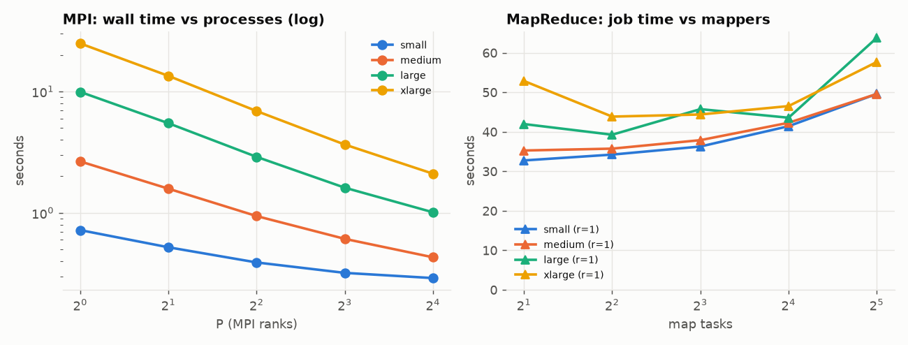
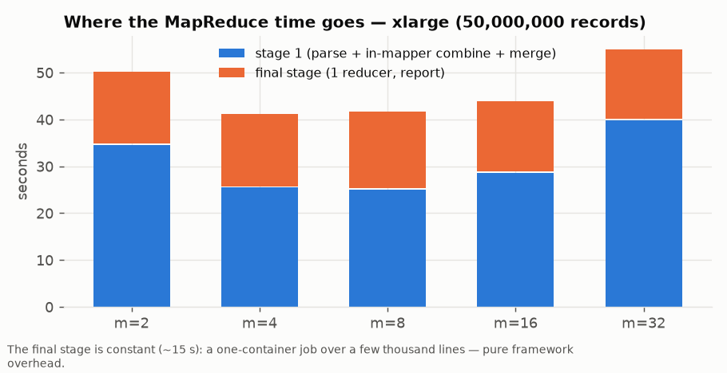
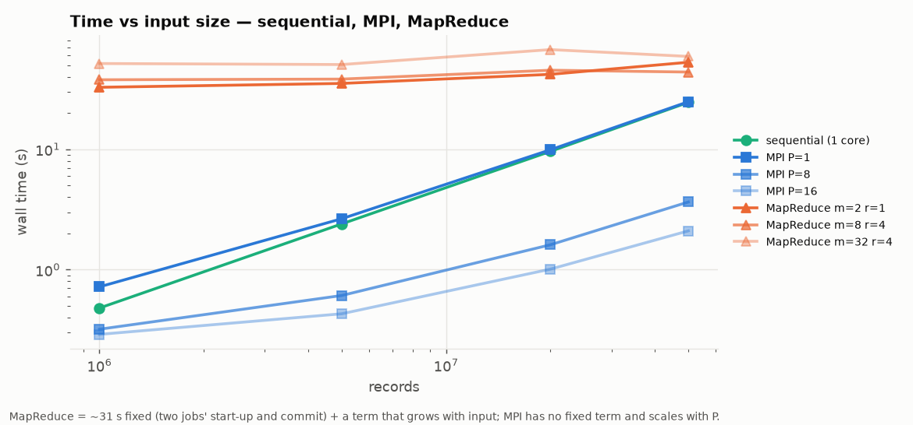
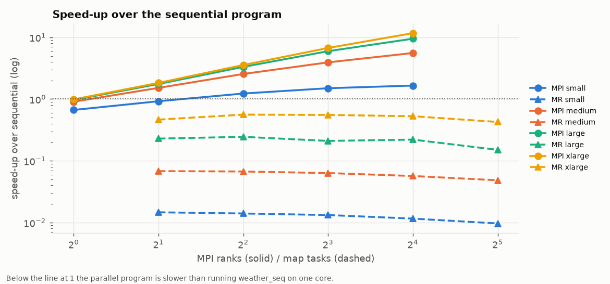

# Section 2, Q1 — Weather analytics as batch MapReduce (Hadoop Streaming, C++)

The HW2 Q8 problem — global statistics, hottest/coldest measurement, busiest
60-second interval and top-K stations over a file of station measurements —
implemented as Hadoop Streaming jobs whose mapper and reducer are standalone
C++ programs, run on a self-hosted Hadoop 3.3.6 / YARN cluster on RCE, and
compared with the HW2 MPI implementation on the same nodes and the same bytes.

| File | Purpose |
|---|---|
| `src/weather_common.hpp` | HW2's shared parser / accumulator / tie-breaks / report writer, unchanged |
| `src/wx_partial.hpp` | the intermediate key/value format and merge logic |
| `src/wx_mapper.cpp` | in-mapper combining: one accumulator per split, partials at end-of-input |
| `src/wx_reducer.cpp` | merges partials by key; used as combiner **and** as stage-1 reducer |
| `src/wx_final.cpp` | the single final reducer: top-K, busiest interval, exact HW2 report |
| `run_hadoop.sh` | two-job (or one-job) driver; records counters and timings |
| `run_local.sh` | the same pipeline without Hadoop (`split` + `sort`) |
| `verify.sh` | 21 checks vs `weather_seq` and vs HW2's independent Python oracle |
| `bench_cluster.sh` | cluster benchmark: sequential, HDFS upload, MR matrix, MPI re-run |
| `plot.py` | figures and `results/cluster/tables.md` |
| `tests/` | HW2's hand-made cases with expected output |

## Build and run

```bash
make                                             # bin/wx_mapper bin/wx_reducer bin/wx_final
(cd "../../q8_from hw2" && make)                 # gen_weather, weather_seq, weather_mpi
bash verify.sh                                   # local pipeline, 21 checks
source ../../hadoop/env.sh
bash run_hadoop.sh data/weather_small.txt out.txt --maps 8 --reducers 4 [--stages 1] [--no-combiner]
diff out.txt <("../../q8_from hw2/bin/weather_seq" data/weather_small.txt)
```

`run_hadoop.sh` accepts a local file (uploaded to HDFS, upload timed
separately) or an `hdfs://`/`/user/...` path (for benchmarks, so the upload is
paid once per dataset). It sets `mapreduce.job.maps` **and**
`split.minsize = ceil(bytes/M)` — Streaming's old-API `TextInputFormat`
ignores `split.maxsize`, and this pair pins exactly M mappers whether M is
above or below the HDFS block count.

Datasets: HW2's generator with HW2's parameters and seed
(`gen_weather N S 10 --seed 2024 --span …`): small 1 M records / 44 MB, medium
5 M / 223 MB, large 20 M / 899 MB, xlarge 50 M / 2.26 GB. Because the generator
is a pure function of its arguments, the cluster regenerates them rather than
downloading them (`bench_cluster.sh`).

## Design

### What the mapper does

The mapper is the sequential HW2 program applied to its split: every line is
parsed with `wx::parse_line` and folded into one `wx::Accum` (counts,
Neumaier-compensated sums, min/max, hottest/coldest candidate with the
assignment's tie-break, per-station counts/sums, per-interval counts). Only at
end-of-input does it emit — **in-mapper combining**:

```
G          \t count extreme Σt Σh Σp Σrain Σwind min/max… hottest coldest     (1 line)
S:<id>     \t count Σtemp Σrain                                          (1 per station seen)
I:<bucket> \t count                                                       (1 per 60-s bucket seen)
H          \t N K S                                                       (only the split holding the header)
```

So the shuffle carries O(S + R) lines per mapper — for the small dataset
≈ 2 000 lines instead of 1 000 000 records; for xlarge ≈ 30 000 instead of
50 000 000. The header line (three fields where records have seven) is
detected and forwarded as `H`, so the final stage learns K from the data
itself rather than from a driver argument.

All doubles are emitted as C99 hex floats (`%a`). Decimal text would either
lose bits or require 17 significant digits; hex floats round-trip exactly, so
the compensated sums survive the shuffle and the final averages agree with
the sequential program to the last printed digit.

### What the reducer does

`wx_reducer` merges lines with equal keys: sums add (again compensated),
min/max fold, hottest/coldest are resolved with `wx::hotter`/`wx::colder`,
station and interval tables add by key. **Its output format is its input
format**, which is what makes it usable as a Hadoop *combiner* (applied 0..n
times on the map side) as well as the stage-1 reducer.

### How the final analytics are obtained

Top-K and busiest interval need a *global* view of the station and interval
tables, so they cannot be finished by parallel reducers that each own a hash
range of keys. Hence two designs, both implemented:

* **Two stages (default).** Job 1: `wx_mapper` → combiner → R × `wx_reducer`,
  producing merged partials partitioned by key. Job 2: identity mapper → one
  `wx_final`, which merges whatever arrives (a few thousand lines), calls
  HW2's `wx::finalize`, `wx::top_stations`, `wx::pick_busiest`,
  `wx::write_report`, and prints the report.
* **One stage** (`--stages 1`). `wx_mapper` → one `wx_final` directly. Fewer
  jobs, but a single reducer receives all M mappers' partials.

Reusing HW2's `finalize`/`top_stations`/`pick_busiest`/`write_report` means the
MapReduce report cannot drift from the sequential one in how it divides,
orders ties, or handles N = 0.

One Streaming quirk: a reducer output line that contains no tab is written as
`key + "\t" + ""` — the report lines gain a trailing tab. The driver strips
it (`sed 's/\t$//'`) when collecting the file, so the artefact that is diffed
is byte-identical to `weather_seq`'s.

## Correctness

`verify.sh`:

1. HW2's six hand-made cases vs their stored expected output, in both designs
   (`tests/`: ties at 40 °C / −5 °C with equal timestamps, ties in station
   counts, K > stations, one station, single record, empty input).
2. Generated datasets vs `weather_seq`: N = 200 003 (prime, so no chunk
   boundary lands neatly) with 7 mappers / 3 reducers and with 1 / 1 in one
   stage; 3 stations vs 4 000 stations; a 60-second span (one bucket); N = 7
   and N = 1 (most mappers see nothing); the 1 M-record benchmark dataset with
   8 mappers / 4 reducers.
3. One generated dataset vs HW2's independent Python oracle (`math.fsum`).

21 / 21 identical. On the cluster, every benchmark run's report is diffed
against `weather_seq` on the same file (`matches sequential` lines in the job
log) and every MPI run's report against the same.

## Experiments

Cluster: 4 RCE nodes (64-core / 384 GB machines; the allocation gave Hadoop
16 vcores and ~90 GB of YARN memory per node, one DataNode + NodeManager
each, HDFS on node-local disk, replication 1). The MapReduce matrix ran inside
the Hadoop job (`bench_cluster.sh`, job 93264); the MPI program ran on the same
node type in its own Slurm job (`mpi_bench.sbatch`, 4 nodes × 4 tasks,
`--map-by node --bind-to core`, job 93427). Every MapReduce run (80 in the
matrix + 8 variants) and every MPI run (60) produced a report identical to
`weather_seq` on the same file.

Raw data in `results/cluster/`: `hadoop_runs.csv` (one row per MR run, with
job counters), `mpi_runs.csv`, `seq_runs.csv`, `hdfs_put.csv`; tables and
figures regenerated by `plot.py` (full tables in `results/cluster/tables.md`).

### Inputs

| size | records | bytes | sequential T₁ (s) | HDFS put (s) |
|---|---|---|---|---|
| small | 1 M | 44 MB | 0.48 | 1.6 |
| medium | 5 M | 223 MB | 2.40 | 1.8 |
| large | 20 M | 899 MB | 9.61 | 2.3 |
| xlarge | 50 M | 2.26 GB | 24.57 | 3.1 |

### MapReduce: job time by mappers × reducers (two-stage design, median of 2)



| size | m=2 r=1 | m=4 r=1 | m=8 r=1 | m=16 r=1 | m=32 r=1 | m=2 r=4 | m=4 r=4 | m=8 r=4 | m=16 r=4 | m=32 r=4 |
|---|---|---|---|---|---|---|---|---|---|---|
| small | 32.7 | 34.2 | 36.3 | 41.4 | 49.6 | 34.2 | 34.3 | 37.8 | 42.4 | 51.6 |
| medium | 35.3 | 35.7 | 37.9 | 42.3 | 49.6 | 35.2 | 35.7 | 38.3 | 42.7 | 50.6 |
| large | 42.0 | 39.3 | 45.7 | 43.6 | 63.8 | 41.9 | 42.0 | 45.4 | 45.2 | 67.4 |
| xlarge | 52.9 | 43.8 | 44.4 | 46.5 | 57.7 | 52.4 | 43.8 | 43.8 | 48.0 | 59.1 |



Reading the table:

* **A floor of ≈ 31 s.** The final stage costs 15 s regardless of input
  (one container reading a few thousand lines), and stage 1 costs 15 s
  before it has processed a single record: two YARN applications, each with
  an ApplicationMaster, container allocation, JVM start-up, and output
  commit. The 1 M-record file — 0.48 s sequentially — takes 32.7 s.
* **Work is only visible on the largest inputs.** Stage 1 on xlarge is 34.5 s
  with 2 mappers (each parses 1.1 GB, ≈ 12 s of C++ on top of the floor) and
  25 s with 4–8 mappers; on small/medium the parse is under a second for any
  mapper count and everything is overhead.
* **More mappers cost more once the work is spread thin.** From m = 8 to
  m = 32 every dataset gets *slower* (small: 36 → 50 s). The Σ map-task time
  column in `tables.md` shows why: 32 map tasks on the 44 MB file accumulate
  585 task-seconds — 18 s each — because each task is a JVM launch plus a
  Streaming child process plus commit, and 32 containers on 4 NodeManagers
  launch in waves. The sweet spot is 4–8 mappers for ≥ 1 GB and 2 for less.
* **Reducers do not matter.** r = 1 vs r = 4 differ by noise (the reducer
  input is O(S + R) lines per mapper — the in-mapper combining already did
  the aggregation), except that 4 reducers add a container or two of
  scheduling.

### Design variants (8 mappers)

| size | two-stage, r=4 | **one-stage: mapper → 1 reducer** | two-stage without combiner | map output records | shuffle bytes |
|---|---|---|---|---|---|
| small | 37.8 s | **21.4 s** | 35.8 s | 15 537 | 404 KB |
| medium | 38.3 s | **22.4 s** | 37.8 s | 50 577 | 1.5 MB |
| large | 45.4 s | **25.2 s** | 38.9 s | 120 657 | 3.6 MB |
| xlarge | 43.8 s | **32.7 s** | 48.7 s | 241 297 | 7.2 MB |

* The **one-stage** design is uniformly 11–16 s faster: it saves an entire
  job. The two-stage design was built for the case where the final merge is
  too big for one reducer — but with in-mapper combining the whole shuffle is
  7 MB even for 50 M records, so one reducer merging 240 000 short lines is
  a fraction of a second. For this problem's sizes the one-stage design is
  strictly better; the two-stage one would only pay off with millions of
  stations or interval buckets.
* The **combiner has no effect** (same map output records, same shuffle
  bytes with or without it, timing within noise). That is expected, not a
  failure: in-mapper combining means each mapper emits each key exactly once,
  so a combiner running over one mapper's output finds nothing to merge. The
  program is still a valid combiner; it simply has no work in this design.
* **Shuffle volume is tiny** — 400 KB to 7 MB against 44 MB to 2.26 GB of
  input (a 100–300× reduction). The data movement that matters is reading the
  input from HDFS, which is node-local here.

### MPI on the same nodes (HW2 program, median of 3)

| size | P=1 | P=2 | P=4 | P=8 | P=16 | speed-up at 16 |
|---|---|---|---|---|---|---|
| small | 0.72 | 0.52 | 0.39 | 0.32 | 0.29 | 2.5× |
| medium | 2.65 | 1.58 | 0.94 | 0.61 | 0.43 | 6.2× |
| large | 9.91 | 5.47 | 2.89 | 1.61 | 1.01 | 9.8× |
| xlarge | 24.86 | 13.43 | 6.89 | 3.65 | 2.10 | 11.8× |

These reproduce HW2's numbers (HW2 measured 24.5 → 3.35 s for P = 1 → 8 on
xlarge; here 24.9 → 3.65, on a different set of nodes). At P = 16 the xlarge
breakdown is read 0.04 s, parse 1.76 s, reduce 0.73 s: the reduction of the
S = 10 000-entry station table and the R ≈ 20 000-bucket histogram across
16 ranks is now a third of the runtime, which is where the efficiency
(74 %) goes.

## MPI vs MapReduce




| size | sequential | MPI best | MapReduce best | MR / MPI | MR throughput | MPI throughput |
|---|---|---|---|---|---|---|
| small | 0.48 s | 0.29 s (P=16) | 32.7 s (m=2, r=1) | 113× | 1 MB/s | 145 MB/s |
| medium | 2.40 s | 0.43 s (P=16) | 35.2 s (m=2, r=4) | 82× | 6 MB/s | 494 MB/s |
| large | 9.61 s | 1.01 s (P=16) | 39.3 s (m=4, r=1) | 39× | 22 MB/s | 849 MB/s |
| xlarge | 24.57 s | 2.10 s (P=16) | 43.8 s (m=4, r=4) | 21× | 49 MB/s | 1 025 MB/s |

(The one-stage MapReduce design would take 21–33 s; the ratios become
74× / 52× / 25× / 16×.)

**Execution time and throughput.** On every input MapReduce is slower than
the *sequential* program — by 68× on small and by 1.8× even on the 2.26 GB
xlarge — and 20–110× slower than MPI. The gap closes as the input grows
because MapReduce's cost is a fixed ~31 s (two-stage) plus a slowly growing
term, while MPI's cost is proportional to input ÷ P. The marginal cost of
MapReduce between small and xlarge is ≈ 4–5 s per GB (m = 4–8) against the
sequential program's 10.9 s per GB, so MapReduce would draw level with
`weather_seq` at roughly 5 GB of input — and with MPI at P = 16 (0.9 s per
GB) not at any size reachable with these mapper counts: MPI's 1 GB/s is 20×
the best MapReduce throughput measured here.

**Scaling with input size.** MPI scales linearly (24.9 s for 2.26 GB, 0.72 s
for 44 MB: 35× the time for 51× the data, the small file being start-up
bound). MapReduce is flat until the per-mapper work exceeds the container
overhead: 33 → 44 s over the same 51× range.

**Scaling with processes/tasks.** MPI gains from every rank up to 16
(efficiency 74 % on xlarge, 15 % on small where the 0.3 s floor of
`mpirun` and the collectives dominates). MapReduce gains from 2 → 4 mappers
on the two big inputs only, then loses: every added task is ~18 s of
container lifetime that must be amortised, and 32 tasks cannot be launched
at once on 4 NodeManagers.

**Memory.** The analytics state is O(S + R) — a few hundred KB — in both.
What differs is the envelope: an MPI rank is one process of ~10 MB RSS;
a Streaming map task is a 2 GB YARN container holding a JVM (~300 MB) plus
the C++ child, and the job also carries a 2 GB ApplicationMaster; the
NodeManagers, DataNodes, NameNode and ResourceManager are five more JVMs.
The 32-mapper run reserves 64 GB of YARN memory to process 44 MB.

**Communication and data movement.** MPI moves the data once (each rank
reads its byte range straight from the shared file) and reduces a few KB of
scalars plus S doubles and R counters — communication that does not depend
on N. MapReduce moves the data twice before computing (upload to HDFS:
1.6–3.1 s, then HDFS → mapper, node-local with replication 1), shuffles
0.4–7 MB of partials to disk and over the network, materialises them in HDFS
between the two jobs, and reads them again. Each step is cheap in absolute
terms; it is the *number* of steps — every one of them a durable write —
that adds up. That durability is also the point: a failed mapper is re-run
from HDFS with no one noticing, whereas a failed MPI rank aborts the job.

**Programming complexity.** The MapReduce version is 286 lines of C++
(mapper 45, reducer 53, final 69, shared format 119) plus a 100-line driver,
against 421 lines for `weather_mpi.cpp` — and the MapReduce lines are
simpler: no byte-range splitting, no boundary-record handling, no
`MPI_Reduce` buffers, no custom reduction for the two-level tie-break. The
framework did the partitioning, the shuffle and the grouping. What the
MapReduce version needed instead was care about the *format*: hex floats so
compensated sums survive text, forwarding the header through the data flow
so K reaches the last reducer, a design decision about where the global
top-K can be computed (only in a single final reducer), and the discovery
that Streaming's old-API input format decides mapper counts differently
from the documentation.

**Flexibility.** Adding a statistic to the MapReduce job means adding a
field to the `G` line (or a new key type) and a merge rule in one place;
adding a per-station or per-interval dimension is a new key prefix. In MPI
each new statistic is a new reduction buffer, and a new grouped dimension
(say per-station-per-day) is a new dense-or-sparse gather design like the
interval histogram's. MapReduce is also indifferent to the input living on
one node's disk or spread across a thousand; the MPI version assumes a
shared POSIX file. Conversely, anything iterative or latency-sensitive is
hopeless in MapReduce (Section 1's 18 s per iteration) and natural in MPI.

**Conclusion.** For this problem — a single pass over a few GB, with tiny
aggregate state — MPI is the right tool and it is not close: 2.1 s against
44 s at the largest input, with linear scaling in both data and processes.
MapReduce's fixed costs (two JVM-heavy jobs, ~31 s) are 60× the sequential
time of the small input and still 30 % more than the sequential time of the
largest one. Its strengths — no explicit partitioning code, fault tolerance,
input that can be far larger than any node's memory or disk — would only
start to matter at inputs of hundreds of GB, where a single MPI job's
shared-file read and lack of fault tolerance become the problem instead.
