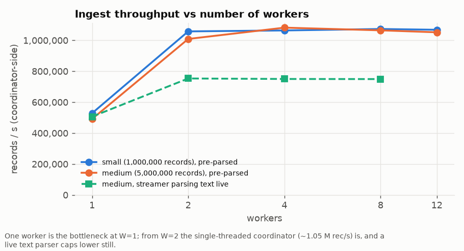
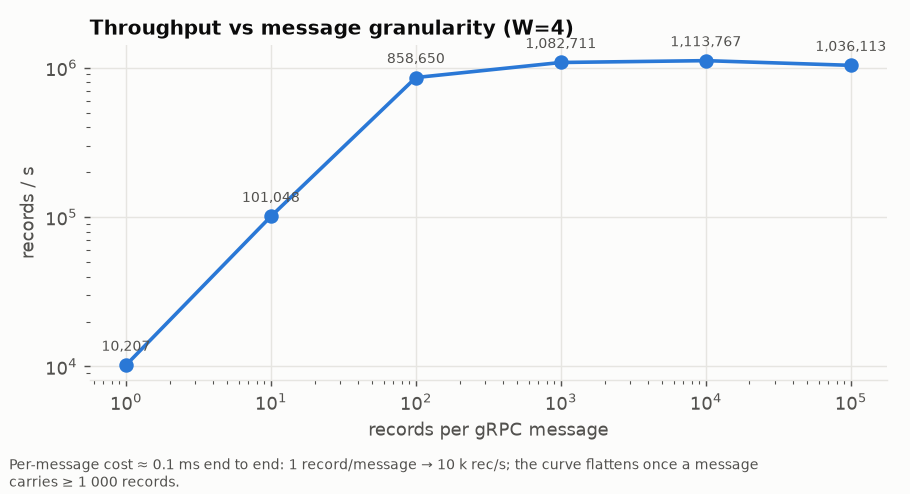
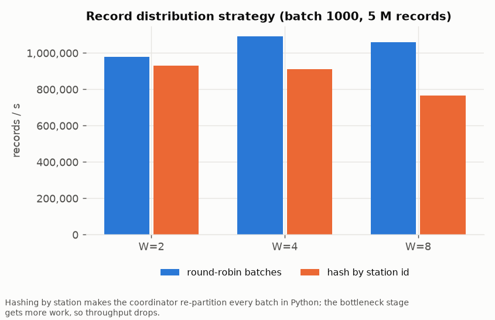
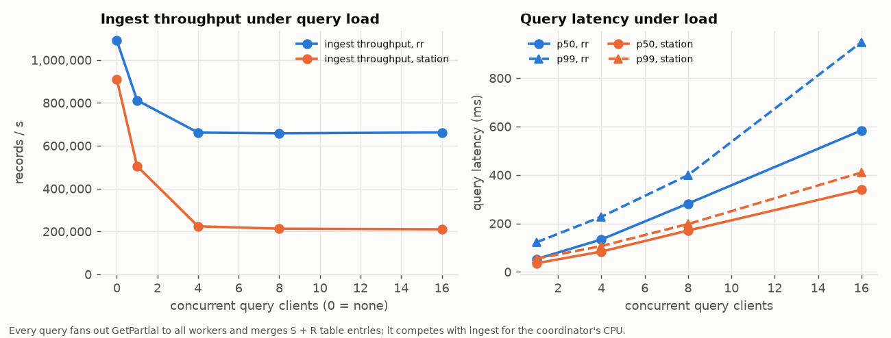

# Section 2, Q2 — Real-time weather analytics with gRPC

The HW2 Q8 problem (station measurements → global statistics, hottest/coldest
reading, busiest 60-second interval, top-K stations) re-implemented as a
**streaming** system: a client replays the dataset as a live feed, a
coordinator fans the records out to several analytics workers, and a CLI
dashboard queries the current state of the analytics *while* the stream is
still arriving. After the last record the answer is byte-identical to the
sequential HW2 program's.

| File | Purpose |
|---|---|
| `proto/weather.proto` | the three services and their messages |
| `common.py` | analytics state (`Partial`), merge, exact HW2 report formatting, dataset reader |
| `worker.py` | analytics worker: applies batches, serves partial-state snapshots |
| `coordinator.py` | ingest endpoint, record distribution, query endpoint (fan-out + merge) |
| `streamer.py` | replays a dataset file as a stream; batch size / rate / preload knobs |
| `dashboard.py` | CLI dashboard (live refresh) and `--final` report for verification |
| `run_local.sh` | everything on one machine + `diff` against `weather_seq` |
| `bench/bench.py`, `bench/query_load.py` | benchmark harness (local or Slurm), concurrent query load |
| `grpc_bench.sbatch` | the 4-node experiment matrix on RCE |
| `plot.py` | figures + `results/cluster/tables.md` |
| `results/cluster/` | raw CSV, tables and figures from the cluster run |

## Setup

```bash
python3 -m venv ~/hw3venv && ~/hw3venv/bin/pip install grpcio grpcio-tools psutil matplotlib
~/hw3venv/bin/python -m grpc_tools.protoc -Iproto --python_out=. --grpc_python_out=. proto/weather.proto
(cd "../../q8_from hw2" && make)        # gen_weather (datasets) and weather_seq (oracle)
```

On RCE: `module load python/3.12.5` before creating the venv.

## Running

```bash
# workers (any hosts)
python3 worker.py --port 60060 --id w0
python3 worker.py --port 60061 --id w1
# coordinator
python3 coordinator.py --port 60051 --workers node02:60060,node03:60061 --dist rr
# dashboard (live, refresh every second)
python3 dashboard.py node01:60051
# stream a dataset at 1000 records/message, unthrottled
python3 streamer.py node01:60051 data/weather_small.txt --batch 1000 --rate 0
# exact HW2 report once the stream is complete
python3 dashboard.py node01:60051 --final --wait | diff - <(weather_seq data/weather_small.txt)
```

`bash run_local.sh DATASET [W] [BATCH] [rr|station] [RATE]` does all of that
on one machine and prints `FINAL REPORT MATCHES weather_seq`.

Datasets are the HW2 generator's (`gen_weather N S K --seed 2024 --span …`):
small = 1 M records / 500 stations, medium = 5 M / 2 000 — the same parameters
and seed as HW2 and as the MapReduce benchmark, so every implementation is
compared on identical bytes.

## Architecture

```
 streamer.py ──StreamRecords(stream IngestMessage)──▶ coordinator.py ──Process(stream RecordBatch)──▶ worker.py  w0
   (replays file,                                       │  dispatch: round-robin batches   ├──▶ worker.py  w1
    batch / rate)                                       │            or hash(station) % W  └──▶ worker.py  w2 …
                                                        │
 dashboard.py ◀──GetAnalytics(QueryRequest)─────────────┘ ◀──GetPartial(Empty)── each worker
 query_load.py     (report + stream state)                 fan-out in parallel, merge, top-K
```

Three processes types, three services:

* **`IngestService.StreamRecords`** (streamer → coordinator) — one
  client-streaming call per replay. The first message carries the dataset
  header (`N K S`) so the system knows K without any out-of-band
  configuration; every later message is a `RecordBatch`.
* **`WorkerService`** (coordinator → worker) — `Process` is a long-lived
  client stream, one per worker per ingest session; `GetPartial` returns the
  worker's whole state; `GetInfo` returns CPU/RSS for the dashboard; `Reset`
  starts a new dataset.
* **`QueryService.GetAnalytics`** (dashboard → coordinator) — returns the HW2
  statistics as they stand plus stream state (records ingested / processed,
  current rate, elapsed, per-worker load, merge time).

### Why columnar batches

`RecordBatch` is seven packed `repeated` arrays (timestamps, station ids,
temperatures, …) rather than a `repeated Record`. For the same payload this is
one message with seven fields instead of a thousand sub-messages to allocate,
parse and iterate — in Python that is the difference between ~100 k and ~1 M
records/s. It is also what makes the batch size a *pure* granularity knob
(experiment B): the bytes on the wire per record barely change with batch size,
only the number of messages does.

### Distribution strategies (`--dist`)

* **`rr`** — whole batches round-robin over workers. No per-record work in the
  coordinator; every worker ends up with a full station table (size S) and a
  full interval table, and a query merges W such tables.
* **`station`** — the coordinator re-buckets every batch by `station_id % W`
  and sends each worker only its stations. Station tables become disjoint (the
  merge is a concatenation, and top-K could be pushed down to workers), at the
  cost of a Python-level re-partition of every batch inside the coordinator.

Experiment C measures the trade-off; see results.

### State and merging

A worker holds one `Partial` — the Python twin of HW2's `wx::Accum`:
counts, Neumaier-compensated sums, min/max, the hottest/coldest candidate with
the assignment's tie-break (temperature, then earlier timestamp, then smaller
station id), a `station → (count, Σtemp, Σrain)` dict and a
`bucket → count` dict. One lock per worker serialises `add_batch` and
`to_pb` snapshots, so a query never observes a half-applied batch.

The coordinator keeps **no analytics state**. A query fans `GetPartial` out to
all workers in a thread pool, merges the W partials with the same `merge`
code the workers would use, applies top-K / busiest-interval, and returns.
Because merging happens per query, the answer is always a consistent
snapshot of "everything the workers have applied so far" — queries and
ingest never block each other (they only share the coordinator's CPU).

Compensated sums matter here for the same reason as in HW2: W workers produce
W partial sums that are added in a different order from the sequential
program's single chain; without compensation the printed second decimal can
flip. With it, every run in the benchmark (`final_match` column) is
byte-identical to `weather_seq`.

### Back-pressure and completion

Each worker link has a bounded queue (64 batches) drained by a sender thread
into the `Process` stream. If workers fall behind, the coordinator's ingest
loop blocks on `queue.put`, gRPC flow control stalls the streamer, and memory
stays bounded. When the streamer closes its stream the coordinator closes all
worker streams, waits for each worker's `WorkerAck`, and only then marks the
session `stream_complete` — `dashboard --final --wait` keys on that flag, which
is how the verification is exact rather than "eventually".

### Dashboard

```
┌─ Weather analytics dashboard ── node01:60051 ── 22:07:18 ─
│ stream: STREAMING ingested      859,000  ( 85.9% of 1,000,000)   processed by workers      857,000
│ rate:        576,638 rec/s   elapsed     1.51s   query latency    25.5 ms (merge 23.7 ms)   queries served 1
│ workers: w0: 287,000 rec, cpu 0.7s, rss 38MB | w1: 289,000 rec, cpu 0.7s, rss 38MB | w2: 286,000 rec, cpu 0.7s, rss 38MB
├──────────────────────────────────────────────────────────────────────────────
│ TOTAL_MEASUREMENTS          857,000
│ TEMPERATURE  avg    20.34   min   -15.94   max    54.35
│ HUMIDITY     avg    55.89   min     2.92   max   100.00
│ PRESSURE     avg  1003.80   min   967.81   max  1039.95
│ RAINFALL   total 12345.67   max    38.12
│ WIND         avg     5.58   max    38.81
│ EXTREME_TEMPERATURE_EVENTS  2,118
│ HOTTEST    54.35 °C  station 12     ts 1700041234
│ COLDEST   -15.94 °C  station 480    ts 1700012345
│ BUSIEST_INTERVAL  bucket 28333395 (789 records)   stations seen 500   intervals seen 1440
│ TOP_STATIONS (K=10)   id     count   avg_temp   total_rain
│                          0    64031      21.47      2345.10
│                          …
└──────────────────────────────────────────────────────────────────────────────
```

It refreshes every `--interval` seconds (default 1) while the stream runs;
`--once` prints a single snapshot; `--final` prints exactly the HW2 report
block; `--raw` dumps the protobuf.

## Correctness

1. `common.py` alone reproduces every HW2 hand-made expected output
   (`../q1_mapreduce/tests/*.expected`).
2. `run_local.sh` on the 1 M-record dataset with W ∈ {2,3,4}, batch ∈ {1, 200,
   1000}, both distribution strategies, and on the empty dataset: final report
   `diff`-identical to `weather_seq` in every case.
3. Every benchmark configuration on the cluster also diffs its final report
   against `weather_seq` (`final_match` column in `results/cluster/grpc_bench.csv`).
4. Mid-stream queries are checked for internal consistency by the harness:
   `records_processed` never exceeds `records_ingested`, and the counts in the
   merged report equal the sum of worker counts.

## Experiments

Run on RCE with `sbatch grpc_bench.sbatch`: coordinator on node 1, workers
spread over nodes 2–3, streamer / query clients / dashboard on node 4, every
process its own `srun` step. `bench/bench.py` starts and tears down the
processes for each configuration, records the coordinator-side throughput
(first batch → last worker ack), the streamer's view, query latency
percentiles from `query_load.py`, CPU seconds and RSS of coordinator and
workers, and whether the final report matched.

Two ways of driving the stream are used, and it matters which:

* **live parse** — the streamer parses the text file as it sends, like a real
  source that produces records on the fly;
* **pre-parsed** (`--preload`) — the whole file is parsed into batches before
  the clock starts. The single Python text parser tops out around 750 k
  records/s, which is *below* what the pipeline can absorb, so without preload
  the worker-count experiment measures the parser, not the system.

## Results

Raw data: `results/cluster/grpc_bench.csv`; tables: `results/cluster/tables.md`
(regenerate with `python3 plot.py`). All figures are medians over repetitions
where repetitions were run. Every configuration's final report matched
`weather_seq` byte for byte.

### A. Number of workers



| dataset | workers | throughput rec/s | processing time s | coordinator CPU s | Σ worker CPU s |
|---|---|---|---|---|---|
| small (1 M) | 1 | 528 000 | 1.89 | 0.5 | 2.0 |
| small | 2 | 1 058 000 | 0.95 | 0.5 | 2.0 |
| small | 4 | 1 064 000 | 0.94 | 0.6 | 3.6 |
| small | 8 | 1 073 000 | 0.93 | 0.6 | 3.7 |
| small | 12 | 1 068 000 | 0.94 | 0.6 | 3.8 |
| medium (5 M) | 1 | 491 000 | 10.18 | 2.3 | 10.8 |
| medium | 2 | 1 009 000 | 4.96 | 2.0 | 10.5 |
| medium | 4 | 1 082 000 | 4.62 | 2.1 | 18.1 |
| medium | 8 | 1 064 000 | 4.70 | 2.2 | 18.4 |
| medium | 12 | 1 052 000 | 4.75 | 2.4 | 18.8 |
| medium, streamer parsing live | 1 / 2 / 4 / 8 | 506 000 / 753 000 / 750 000 / 749 000 | | | |

Two bottlenecks, one after the other. With one worker the worker is the
limit: ~500 k records/s is what one Python process can fold into its
accumulator (≈ 2 µs per record). Adding a second worker doubles throughput
almost exactly (1.06 M), and then the curve goes flat: from W = 2 on, the
coordinator's single ingest thread — deserialising batches and dispatching
them — is saturated at ≈ 1.05–1.08 M records/s, and further workers only
share the same load (Σ worker CPU rises with W because each also snapshots
tables and idles in gRPC polling, but the sum of *useful* work is constant).
When the streamer parses the text file as it goes, it caps everything at
≈ 750 k records/s regardless of W — a single text parser is slower than the
pipeline behind it, which is why the main matrix uses the pre-parsed stream.

The design implication is clear: with the state sharded across workers, the
scalable resource is worker CPU; the stateless coordinator is the serial
component and, in Python, it caps the system at roughly two workers' worth
of throughput. Removing that cap means either several coordinators (the
streamer(s) hashing over them) or a compiled coordinator; both keep the
worker/query design unchanged.

### B. Message granularity



| records / message | messages | throughput rec/s | processing time s | coordinator CPU s |
|---|---|---|---|---|
| 1 | 1 000 000 | 10 200 | 97.97 | 156.7 |
| 10 | 100 000 | 101 000 | 9.90 | 15.9 |
| 100 | 10 000 | 859 000 | 1.16 | 2.0 |
| 1 000 | 1 000 | 1 083 000 | 0.92 | 0.5 |
| 10 000 | 100 | 1 114 000 | 0.90 | 0.5 |
| 100 000 | 10 | 1 036 000 | 0.97 | 0.5 |

Throughput is linear in batch size until ~100 records per message and flat
after ~1 000. The per-message cost is ≈ 100 µs of coordinator CPU
(156.7 s / 10⁶ messages) — gRPC framing, a Python callback, the dispatch
queue hand-off — against ≈ 0.9 µs per record of payload work. One record per
message therefore buys 10 k records/s; ten thousand per message buys 1.1 M.
Past 10 000 the very large messages (100 000 records ≈ 5 MB) start to cost
again: allocation of big protobuf objects and burstier queues. For a system
that must also answer queries promptly, 1 000 is the sweet spot: it is on
the plateau while a batch is still only ~1 ms of work, so the coordinator
stays responsive.

### C. Distribution strategy



| workers | round-robin rec/s | hash by station rec/s | coordinator CPU s (rr / station) |
|---|---|---|---|
| 2 | 979 000 | 932 000 | 2.2 / 6.2 |
| 4 | 1 091 000 | 911 000 | 2.1 / 7.3 |
| 8 | 1 059 000 | 764 000 | 2.4 / 8.9 |

Hashing by station triples the coordinator's CPU time (the Python
re-partition touches every record) and, since the coordinator is the
bottleneck stage, throughput drops — by 5 % at W = 2 and 28 % at W = 8, where
each batch is split eight ways into eight small messages. Its benefit —
disjoint per-station tables — is real but small here: a query merges
4 × 2 000 station rows in a couple of milliseconds either way (table D shows
identical medians for both strategies). Round-robin is the right default for
this workload; station hashing would pay off only if the per-station state
were large enough that replicating it W times mattered, or if the top-K were
pushed down to the workers.

### D. Concurrent queries during ingest



Only queries answered while the stream was flowing are counted (the load
generator tags each answer with the coordinator's `stream_active` flag, and
the pre-parsed streamer opens the RPC only after parsing, so the window is
exactly the ~5–8 s of ingest). Clients issue queries back-to-back with no
think time — a worst-case query load, not a dashboard refreshing once a
second.

| dist | query clients | ingest rec/s | queries during stream | QPS | latency p50 ms | p95 ms | p99 ms |
|---|---|---|---|---|---|---|---|
| rr | 0 | 1 082 000 | – | – | – | – | – |
| rr | 1 | 812 000 | 112 | 18 | 52.8 | 66.8 | 121.9 |
| rr | 4 | 661 000 | 223 | 30 | 134.0 | 180.4 | 227.7 |
| rr | 8 | 658 000 | 214 | 28 | 282.0 | 367.4 | 399.4 |
| rr | 16 | 662 000 | 208 | 28 | 583.8 | 822.6 | 948.4 |
| station | 0 | 911 000 | – | – | – | – | – |
| station | 1 | 505 000 | 275 | 28 | 35.5 | 45.7 | 54.5 |
| station | 4 | 224 000 | 1 059 | 47 | 84.0 | 101.6 | 106.8 |
| station | 8 | 213 000 | 1 103 | 47 | 170.8 | 190.3 | 197.6 |
| station | 16 | 210 000 | 1 119 | 47 | 339.0 | 393.7 | 410.0 |

For reference, the same query against an **idle** system with the same tables
costs ≈ 12 ms (small dataset, 500 stations) — four `GetPartial` snapshots of
≈ 2 000 rows each, parsed and merged in Python — and ≈ 25 ms for the medium
dataset's 6 300 rows per worker. What the table adds is the interaction with
ingest:

* **A query is a GIL-bound Python job in the same process as ingest.** With
  the ingest thread saturating the interpreter, one client's query stretches
  from 25 ms to 53 ms, and while it runs it takes ~25 % off the ingest rate.
  More clients do not get more queries answered: the service tops out at
  ≈ 30 QPS (round-robin) and p50 grows linearly with the number of clients
  (53 → 134 → 282 → 584 ms), i.e. they queue for the same ~35 ms of
  interpreter time each.
* **Ingest throughput, not query latency, is what degrades gracefully**: 1 →
  16 hammering clients cost ingest 25 → 40 %, no more, because the gRPC
  server thread pool caps how many queries are in flight and the ingest
  thread keeps competing on equal terms.
* **With station hashing** the coordinator is already CPU-bound on
  re-partitioning; adding queries collapses ingest to ≈ 220 k records/s while
  queries themselves are *faster* (35 ms, 47 QPS) — the ingest thread yields
  the interpreter more often. The two loads simply split a saturated core.

The remedy is structural, not a tuning knob: move the merge off the
coordinator (e.g. a separate query-service process holding a periodically
refreshed merged snapshot, or workers pre-aggregating the top-K so a query
moves K rows instead of S), or run the coordinator in a runtime without a
global interpreter lock.

### E. A realistic operating point

A source throttled to 200 000 records/s (the streamer's `--rate`) with four
concurrent back-to-back query clients on the small dataset: the system
sustains **198 000 records/s** — the target — while answering **108 queries/s
at p50 36.6 ms, p99 51.8 ms**. Below saturation, ingestion keeps its rate and
query latency stays within 3× of the idle figure; a dashboard refreshing once
a second would be invisible in the ingest numbers.

### Summary of observations

| question | answer from the data |
|---|---|
| does adding workers help? | yes until the coordinator saturates: 1 → 2 workers doubles throughput; beyond that the coordinator (~1.05 M rec/s) is the limit |
| best message size | ≥ 1 000 records/message; per-message overhead ≈ 0.1 ms, so 1 record/message is 100× slower |
| how to distribute records | round-robin batches; hashing by station costs 3× coordinator CPU for no measurable query benefit at this state size |
| can it be queried while streaming? | yes, consistently: 12–25 ms per query on an idle system, ~50 ms while ingest saturates the coordinator; a back-to-back query loop costs ingest 25–40 % because it shares the coordinator's interpreter lock |
| memory | workers stay at 40–60 MB RSS regardless of dataset size (state is O(S + R), not O(N)); coordinator 50–60 MB |
| correctness | every configuration's final report is byte-identical to the sequential HW2 program |
